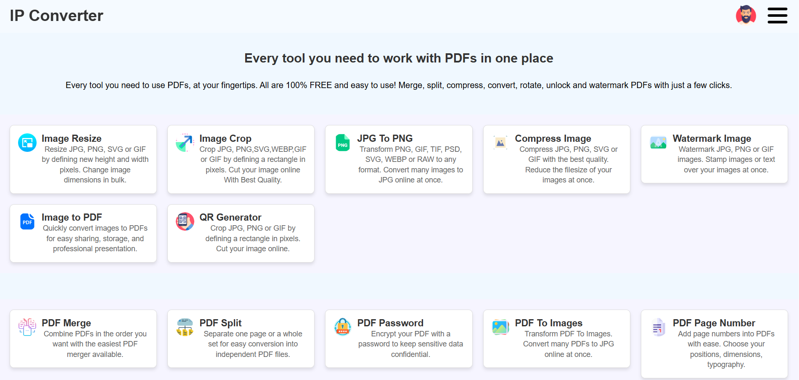
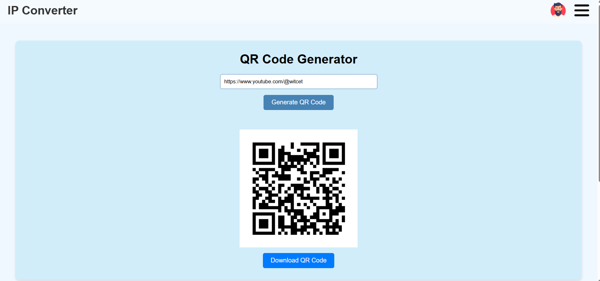
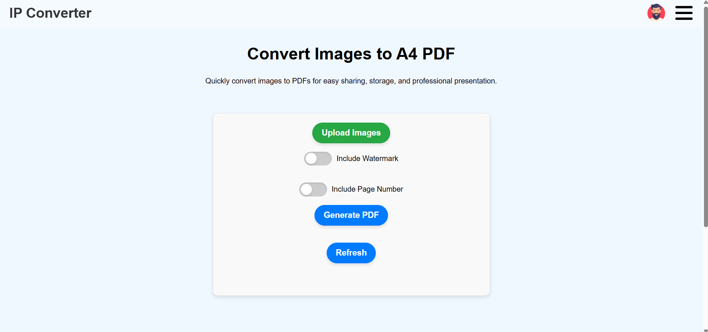
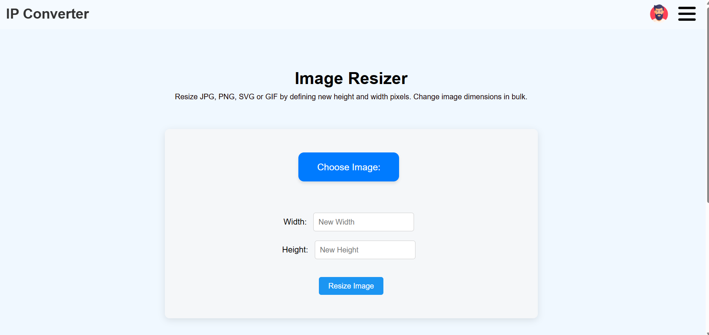

# 🧰 ImagePDF Converter

**Your all-in-one toolbox for working with PDFs and images — 100% FREE and easy to use!**

🔗 Live Website: [imagepdf-converter.netlify.app](https://imagepdf-converter.netlify.app)

---

## 📄 About

ImagePDF Converter is a powerful online utility that gives you access to essential tools for handling PDFs and images — all at your fingertips. No downloads or registrations required!

Whether you need to **merge**, **split**, **compress**, **convert**, or **protect** PDFs — or **crop**, **resize**, and **watermark** images — this tool has you covered.

---

## 🚀 Features

### 📂 PDF Tools
- ✅ **Merge PDFs** – Combine multiple PDF files into one.
- ✅ **Split PDF** – Split a PDF into individual pages or extract specific sections.
- ✅ **Compress PDF** – Reduce PDF file size without quality loss.
- ✅ **PDF to Image Converter** – Convert PDF pages into images (JPG, PNG).
- ✅ **Add PDF Password** – Protect your PDFs with a password.
- ✅ **Unlock PDF** – Remove password protection from PDFs.
- ✅ **Rotate PDF** – Rotate individual or all pages in a PDF.
- ✅ **Add PDF Watermark** – Overlay text/image watermarks on PDF files.

### 🖼️ Image Tools
- ✅ **Image to PDF Converter** – Turn your images into PDFs.
- ✅ **Image Compressor** – Shrink image file size without noticeable quality loss.
- ✅ **Image Cropping** – Crop your images online easily.
- ✅ **Image Watermarking** – Add watermarks to your images to protect your work.
- ✅ **Image Resizer** – Resize images to specific dimensions.
- ✅ **Image Extension Converter** – Convert between formats like JPG, PNG, WEBP, etc.

### 🎯 Others
- ✅ **QR Code Generator** – Create custom QR codes for URLs or text.

---

## 🖼️ Screenshots

### 🔧 Tools Dashboard  

### 📑 QR Generator  Tool  

### 🖼️ PDF to image Converter  

### 🖼️ Image to PDF Converter  

### 🔐 Image Resize Tool  

> You can add more screenshots as needed by uploading them and adding similar Markdown image lines.

---

## 🧩 Topics Covered

